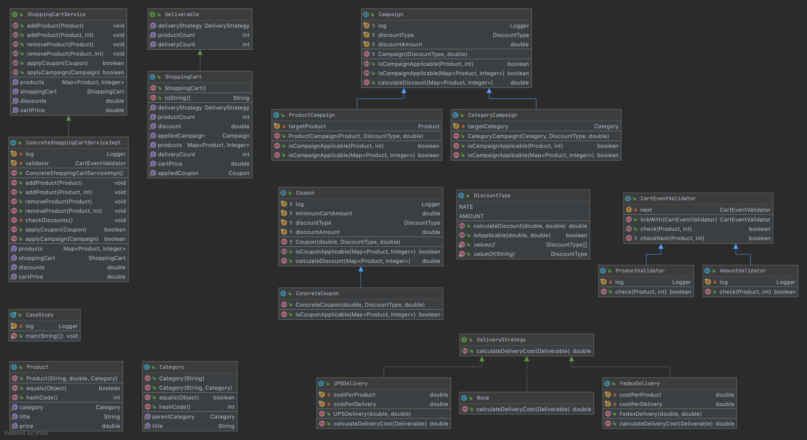

<h1 align="center">case-study</h1>

<div align="center">
  Java implementation of shopping cart case study
</div>

<br />

<div align="center">
  <!-- last commit-->
  <a href="https://github.com/akadir/case-study/commits" title="Last Commit">
   
  </a>
  
  <!-- Code Quality -->
  <a href="https://github.com/akadir/case-study/actions">
    
  </a>
  
  <!-- macos -->
  <a href="https://github.com/akadir/case-study/actions">
    
  </a>
  
  <!-- ubuntu -->
  <a href="https://github.com/akadir/case-study/actions">
    
  </a>
  
  <!-- windows -->
  <a href="https://github.com/akadir/case-study/actions">
    
  </a>
  
  <!-- Docker push -->
  <a href="https://github.com/akadir/case-study/actions">
   
  </a>  
  
  <!-- Docker image size -->
  <a href="https://hub.docker.com/r/akarakoc/case-study/tags">
   
  </a>  
  
  <!-- Docker image version -->
  <a href="https://hub.docker.com/r/akarakoc/case-study/tags">
   
  </a>
  
  <!-- Quality Gate Status -->
  <a href="https://sonarcloud.io/dashboard?id=akadir_case-study">
    
  </a>
  
  <!-- Code Coverage -->
  <a href="https://sonarcloud.io/component_measures?id=akadir_case-study&metric=coverage&view=list">
    
  </a>
  
  <!-- Technical Dept -->
  <a href="https://sonarcloud.io/component_measures?id=akadir_case-study&metric=sqale_index&view=list">
    
  </a>
  
  <!-- Code Smell -->
  <a href="https://sonarcloud.io/project/issues?id=akadir_case-study&resolved=false&types=CODE_SMELL">
    
  </a>
</div>

# Content

   * [Run](#run)
      * [Using Maven](#using-maven)
      * [Using Docker](#using-docker)
   * [UML class diagram](#uml-class-diagram)
   * [Applied Design Patterns](#applied-design-patterns)
   * [Pipeline Definitions](#pipeline-definitions)
   * [Used Tools, Frameworks, Libraries etc.](#developed-with-the-help-of)

## Run

### Using Maven

Make sure you have maven installed on your system.

```sh
git clone https://github.com/akadir/case-study.git
cd case-study
mvn package -DskipTests
java -jar target/case-study.jar
```

### Using Docker

Pull the latest image from [docker-hub](https://hub.docker.com/) and then run it.

```
docker pull akarakoc/case-study:1.0
docker run akarakoc/case-study:1.0
```

## UML class diagram

[](.documents/uml-diagram.png)

## Applied Design Patterns

- [Chain of Responsibility](https://refactoring.guru/design-patterns/chain-of-responsibility): To validate products added into cart.
This pattern, makes it easy to extend and re-configure validation phase. [CartEventValidator](./src/main/java/io/github/akadir/casestudy/shopping/validator/CartEventValidator.java)
- [Strategy Pattern](https://refactoring.guru/design-patterns/strategy): Delivery cost calculation algorithms can changed in time frequently.
Using this pattern makes it easy to adapt this algorithm changes. [DeliveryStrategy](./src/main/java/io/github/akadir/casestudy/delivery/strategy/DeliveryStrategy.java)
- [Null Object Pattern](https://en.wikipedia.org/wiki/Null_object_pattern): In the initial phase of the [ShoppingCart](./src/main/java/io/github/akadir/casestudy/shopping/model/ShoppingCart.java#L18) DeliveryStrategy is not set yet. 
This may lead to a NullPointerException. To prevent this from occurring, [None](./src/main/java/io/github/akadir/casestudy/delivery/strategy/None.java) DeliveryStrategy is implemented.

## Pipeline Definitions

All action logs can be seen from [this link](https://github.com/akadir/case-study/actions)
and action definitions are in [this folder](./.github/workflows)

- Every push that contains change in specific folders and/or files triggers two actions, build, and code quality.
    - Build Action builds source code on 3 different Operating Systems[Ubuntu, MacOS, Windows] using 3 different java versions[8, 11, 14].

- Every tagged push event triggers the [docker](https://github.com/akadir/case-study/actions?query=workflow%3A%22push+docker+image%22) 
workflow and this workflow builds artifacts then push the docker image to the [docker hub](https://hub.docker.com/r/akarakoc/case-study/tags) 

## Developed with the Help of

 *  [IntelliJ IDEA](https://www.jetbrains.com/idea/) - Development environment
 *  [maven](https://maven.apache.org/) - Build automation and dependency management tool.
 *  [logback](http://logback.qos.ch/) - Logging library that implements SLF4J API
 *  [mockito](https://site.mockito.org/) - Testing framework to mock objects.
 *  [AssertJ](https://joel-costigliola.github.io/assertj/) - Rich and easy to use test assertion library
 *  [Docker](https://www.docker.com/) - Containerisation tool
 *  [SonarCloud](https://sonarcloud.io/) - Online Code Quality & Security service
 *  [GitHub Actions](https://github.com/features/actions) - Software workflow automation tool
 *  [gitignore.io](https://gitignore.io/) - Utility website to generate .gitignore files
